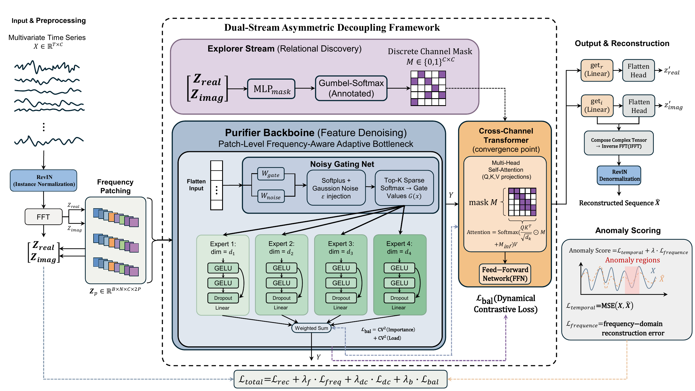

# PFAIB

**Patch-Level Frequency-Aware Adaptive Information Bottleneck for Multivariate Time Series Anomaly Detection**

This repository contains the implementation of **PFAIB**, a reconstruction-based framework for unsupervised multivariate time-series anomaly detection. PFAIB extends frequency-domain patching with patch-level adaptive information bottlenecks, so that different spectral regions are reconstructed under different information budgets.

<p align="center">
  
</p>

## Overview

Multivariate time-series anomaly detection is challenging because anomalies may appear as point spikes, contextual shifts, collective deviations, spectral distortions, or abnormal cross-variable relations. Reconstruction-based detectors can over-reconstruct anomalous segments when their reconstruction path is too expressive, reducing the error gap between normal and abnormal patterns.

PFAIB addresses this issue from a capacity-control perspective. It maps input windows to complex frequency-domain patches and routes each patch to heterogeneous bottleneck experts according to spectral content, patch energy, and frequency position. An asymmetric dual-stream cross-channel module uses raw frequency patches to infer channel dependency masks while using bottleneck-regularized features for reconstruction.

The main components are:

- **Frequency-domain patching** for capturing local spectral patterns and long-range periodic structure.
- **Patch-level adaptive bottleneck routing** that assigns different reconstruction capacities to different frequency patches.
- **Sparse MoE as capacity regularization**, where experts are heterogeneous bottlenecks rather than only capacity-expansion modules.
- **Asymmetric cross-channel fusion** that decouples relation discovery from feature regularization.
- **Joint anomaly scoring** based on time-domain reconstruction discrepancy and frequency-domain reconstruction discrepancy.

## Repository Structure

```text
config/                         Benchmark configuration files
docs/                           README figures
scripts/run_benchmark.py        Main benchmark runner
scripts/multivariate_detection/ Per-dataset experiment scripts
ts_benchmark/                   Evaluation framework and model code
ts_benchmark/baselines/catch/   PFAIB implementation entry point
```

The model is currently invoked as `catch.CATCH` because PFAIB is implemented by extending the CATCH-style frequency-patching adapter. In this repository, the default configuration enables PFAIB through:

```python
use_adaptive_bottleneck = True
```

Core implementation files:

- `ts_benchmark/baselines/catch/CATCH.py`
- `ts_benchmark/baselines/catch/models/CATCH_model.py`
- `ts_benchmark/baselines/catch/layers/adaptive_bottleneck.py`
- `ts_benchmark/baselines/catch/layers/channel_mask.py`

## Installation

Create a Python environment and install the dependencies:

```bash
pip install -r requirements.txt
```

The code was developed for Python 3.8+ and PyTorch-based execution. GPU execution is recommended for full benchmark runs.

## Data Preparation

Place anomaly-detection datasets under the following structure:

```text
dataset/
  anomaly_detect/
    DETECT_META.csv
    data/
      MSL.csv
      SMAP.csv
      PSM.csv
      ...
    covariates/
      ...
```

The `dataset/` directory is ignored by Git and should not be committed. Results are written to `result/`, which is also ignored.

## Quick Start

Run PFAIB on MSL with label-level evaluation:

```bash
python ./scripts/run_benchmark.py \
  --config-path "unfixed_detect_label_multi_config.json" \
  --data-name-list "MSL.csv" \
  --model-name "catch.CATCH" \
  --model-hyper-params '{"use_adaptive_bottleneck": true, "bn_dims": [64, 128, 256, 512], "k_experts": 2, "bn_loss_coef": 0.01, "routing_level": "patch", "use_frequency_router_features": true, "lr": 0.0005, "Mlr": 0.00001, "batch_size": 128, "cf_dim": 32, "d_ff": 256, "d_model": 256, "dc_lambda": 0.1, "dropout": 0.05, "e_layers": 3, "head_dim": 32, "head_dropout": 0.1, "n_heads": 1, "num_epochs": 5, "patch_size": 16, "patch_stride": 8, "score_lambda": 0.05, "seq_len": 192, "anomaly_ratio": 5.0}' \
  --gpus 0 \
  --num-workers 1 \
  --timeout 60000 \
  --save-path "label/PFAIB"
```

Run score-level evaluation:

```bash
python ./scripts/run_benchmark.py \
  --config-path "unfixed_detect_score_multi_config.json" \
  --data-name-list "MSL.csv" \
  --model-name "catch.CATCH" \
  --model-hyper-params '{"use_adaptive_bottleneck": true, "bn_dims": [64, 128, 256, 512], "k_experts": 2, "bn_loss_coef": 0.01, "routing_level": "patch", "use_frequency_router_features": true, "lr": 0.0005, "Mlr": 0.00005, "batch_size": 128, "cf_dim": 64, "d_ff": 256, "d_model": 128, "e_layers": 3, "head_dim": 64, "n_heads": 2, "num_epochs": 5, "patch_size": 16, "patch_stride": 8, "seq_len": 192}' \
  --gpus 0 \
  --num-workers 1 \
  --timeout 60000 \
  --save-path "score/PFAIB"
```

Existing shell scripts are provided under `scripts/multivariate_detection/`. They can be run from Linux, WSL, or Git Bash, for example:

```bash
sh ./scripts/multivariate_detection/detect_label/MSL_script/CATCH.sh
```

## Important Hyperparameters

PFAIB-specific hyperparameters include:

- `use_adaptive_bottleneck`: enables the PFAIB bottleneck module.
- `bn_dims`: hidden widths of heterogeneous bottleneck experts.
- `k_experts`: number of active experts selected by top-k routing.
- `bn_loss_coef`: load-balancing regularization coefficient for sparse routing.
- `routing_level`: use `"patch"` for patch-level routing.
- `use_frequency_router_features`: adds patch energy, frequency coordinate, and frequency embedding to the router.
- `freq_pos_dim`: dimensionality of learnable frequency-position embeddings.
- `bottleneck_residual`: residual mode for bottleneck experts.

To run a CATCH-compatible baseline without the adaptive bottleneck, set:

```json
{"use_adaptive_bottleneck": false}
```

## Experiments

The manuscript evaluates PFAIB on 11 real-world multivariate anomaly-detection datasets and six TODS synthetic anomaly settings. The benchmark covers spacecraft telemetry, server machines, water-treatment systems, web services, financial transactions, machinery, application servers, and synthetic anomaly types including contextual, global, seasonal, shapelet, trend, and mixture anomalies.

Compared with the closest frequency-patching baseline CATCH, PFAIB improves anomaly separability on representative datasets such as MSL, PSM, SMD, SMAP, and ASD. Ablation and routing analyses show that frequency-aware cues, adaptive bottleneck capacity, and patch-level information allocation are all important for the final performance.

## Citation

If you use this repository, please cite the PFAIB manuscript:

```bibtex
@article{lu2026pfaib,
  title   = {Patch-Level Frequency-Aware Adaptive Information Bottleneck for Multivariate Time Series Anomaly Detection},
  author  = {Lu, Hongbo and Zhu, Zhengzheng and Li, Kexin and Lv, Ang and Zhang, Ruihua and Zheng, Minhua and Xie, Zhibo},
  journal = {Manuscript under review},
  year    = {2026}
}
```

This implementation builds on the frequency-patching and benchmark structure of CATCH/TAB. Please also cite the corresponding works when comparing with or reusing their components.

```bibtex
@inproceedings{wu2025catch,
  title     = {{CATCH}: Channel-Aware Multivariate Time Series Anomaly Detection via Frequency Patching},
  author    = {Wu, Xingjian and Qiu, Xiangfei and Li, Zhengyu and Wang, Yihang and Hu, Jilin and Guo, Chenjuan and Xiong, Hui and Yang, Bin},
  booktitle = {ICLR},
  year      = {2025}
}
```

## Acknowledgements

We thank the authors of CATCH and TAB for releasing their code and benchmark resources. This repository adapts their frequency-patching benchmark framework for the PFAIB study.
